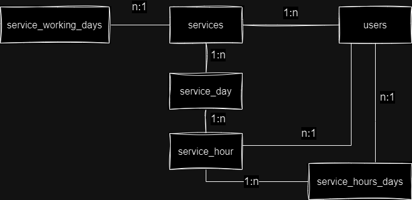

# MaaS (Monitoring as a Service) Backend API

API para el proyecto MaaS (Monitoring as a Service) desarrollado con Ruby on Rails.

## Modelo relacional

Las tablas utilizadas en el proyecto son las siguientes:

1. **Users:** Almacena los usuarios registrados en el sistema. Contiene información esencial de los usuarios, como nombre, correo electrónico, contraseña, etc. Además contiene el rol del usuario (admin o usuario).

2. **Services:** Contiene información sobre los servicios que se monitorean en el sistema. Además del nombre y el estado actual del servicio (en actividad o inactivo), almacena una referencia a las semanas de servicio que se desean monitorear.

### Semanas de servicio (service weeks):

3. **ServiceWeeks:** Contiene información sobre las semanas de trabajo que se monitorean en el sistema. Contiene un máximo de 7 ServiceDays, correspondientes a los días de la semana.

4. **ServiceDays:** Contiene información sobre los días de la semana que se monitorean en el sistema. Contiene un máximo de 24 ServiceHours, correspondientes a las horas de trabajo.

5. **ServiceHours:** Contiene información sobre las horas de trabajo que se monitorean en el sistema. Aquí se almacenan tanto los usuarios que se encuentran disponibles para ser asignados para el turno, como también el usuario que ha sido designado para el turno de acuerdo a la última ejecución del algoritmo de asignación.

6. **ServiceHoursUsers:** Tabla pivote que relaciona las horas de trabajo con los usuarios que se encuentran disponibles para ser asignados para el turno. El número máximo de instancias asociadas a una misma hora es igual al total de usuarios en el sistema.

### Semanas de trabajo (working days):

6. **ServiceWorkingDays:** Contiene información sobre los días de trabajo que se monitorean en el sistema.



## Dependencias utilizadas

- Ruby (v3.2.0)
- Ruby on Rails (v7.1.3)
- PostgreSQL
- Devise
- JWT

### Testing

- RSpec
- Guard
- FactoryBot

## Instalación del proyecto

**1.** Instalar las gemas con el comando

```bash
bundle install
```

**2.** Antes de crear la base de datos, debemos crear el secret del JWT para el entorno de desarrollo. Para ello ejecutamos el siguiente comando

```bash
bundle exec rails secret
```

El resultado del comando anterior es un hash largo que debemos copiar y pegar en el archivo .env. El nombre de la variable de entorno debe ser DEVISE_JWT_SECRET_KEY.

```
DEVISE_JWT_SECRET_KEY=<el secret generado del paso anterior>
```

**3.** Crear la base de datos y agregar migraciones y seeders con los comandos

```bash
rails db:create
rails db:migrate
rails db:seed
```

**4.** Ejecutar el proyecto con el comando

```bash
rails s
```

## Pruebas

Los tests unitarios y de features fueron realizados con **RSpec** siguiendo el principio de TDD (_Test Driven Development_). Para la ejecución de los tests se utilizó la gema **Guard**, que se encarga de ejecutar los tests en tiempo real según la ubicación del archivo modificado en nuestro proyecto.

Para verificar los tests ejecutar el comando:

```bash
bundle exec guard
```
