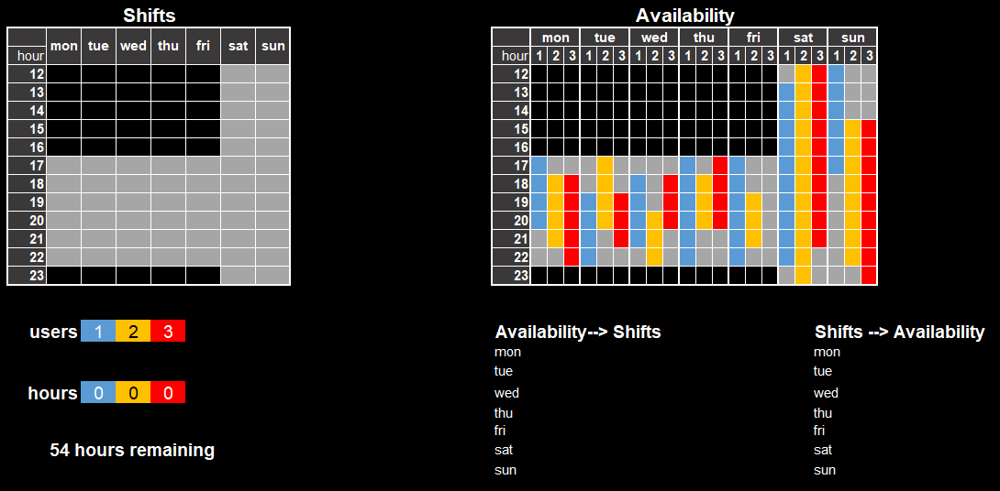
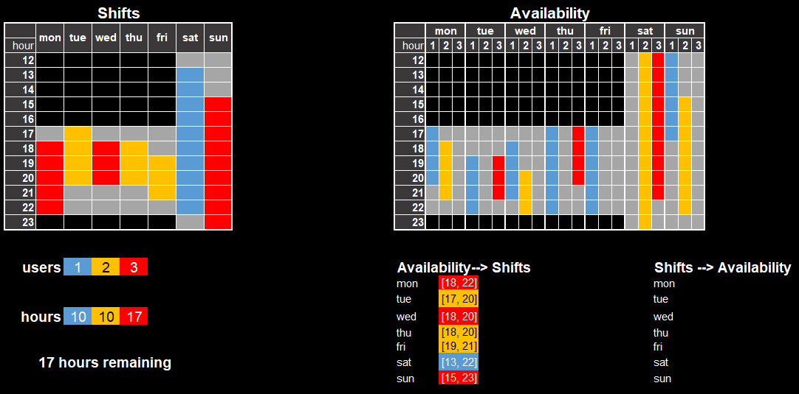
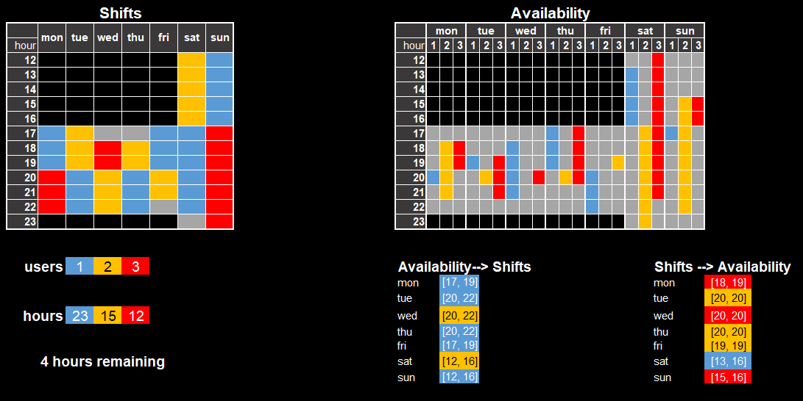
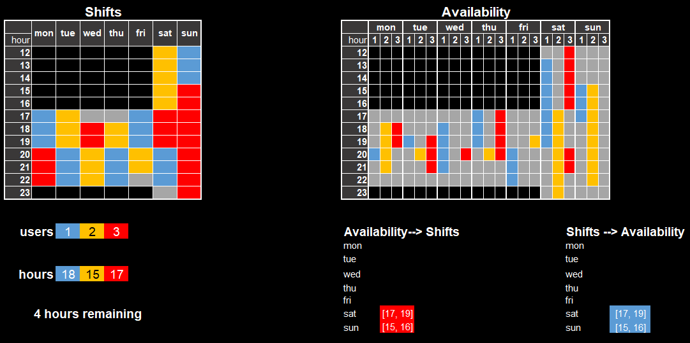
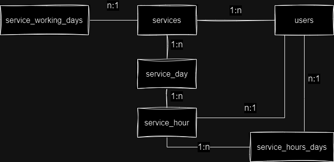

# MaaS (Monitoring as a Service) Backend API

API for the MaaS (Monitoring as a Service) project developed with Ruby on Rails. This codebase includes the endpoint API, business logic and the algorithm for the shifts scheduling.

## Features

### Authentication and authorization

The application uses JWT authentication and authorization. The JWT token is generated by the Devise gem and is used to authenticate the user. The authorization is handled by the Devise JWT gem, which allows the user to have different roles (admin or user) and access different resources based on their role.

### Shifts Scheduling Algorithm

The assignation of shifts is handled by the shifts scheduling algorithm, which is implemented in the service object `ShiftSchedulerService`. This algorithm is responsible for generating or updating the shifts for the given week based on the available hours of each user.

Prior to executing the service, the algorithm transforms the input availability JSON into a hash structure that is easier to work with. The chosen approach for this transformation is the usage of intervals to represent the hour blocks for each user in the data structure. For example, for the following availability JSON:

```json
  {
    "serviceDays": [
      {
        "day": "1",
        "serviceHours": [
          { "hour": 8, "available": { "101": true, "102": false } },
          { "hour": 9, "available": { "101": true, "102": true } },
          { "hour": 10, "available": { "101": false, "102": true } }
          { "hour": 11, "available": { "101": false, "102": true } },
          { "hour": 12, "available": { "101": true, "102": true } },
          { "hour": 13, "available": { "101": true, "102": true } }
        ]
      },
      {
        "day": "2",
        "serviceHours": [
          { "hour": 8, "available": { "101": false, "102": true } },
          { "hour": 9, "available": { "101": false, "102": true } },
          { "hour": 10, "available": { "101": false, "102": true } },
          { "hour": 11, "available": { "101": false, "102": true } },
          { "hour": 12, "available": { "101": false, "102": false } },
          { "hour": 13, "available": { "101": false, "102": false } }
        ]
      }
    ]
  }
```

The resulting hash structure would be:

```json
{
  "1": {
    "101": [ [8, 9], [12, 13] ],
    "102": [ [9, 13] ]
  },
  "2": {
    "101": [ [8, 11] ],
  }
}
```

Basically, the original JSON structure is compressed into a hash whose keys are the days of the week and the values are hashes with the users as keys and the corresponding intervals as values. For instance, the user 101 is available from 8:00 to 9:00 and from 12:00 to 13:00 on Monday, while user 102 is available from 9:00 to 13:00 on Monday. The user 102 is the only user available on Tuesday, with an hour block from 8:00 to 11:00.

With that settled, the algorithm proceeds to run the various iterations of analysis and transformations, which are described in the following stages. The goal of each stage is to look up an interval that fulfills the stage's requirements and write it in the shifts hash, which will be the variable the service is going to return. 

The shifts hash is a hash with the days of the week as keys and the users as values. For example, for a service that operates monday to friday from 14:00 to 20:00, the data structure will look like this:

```ruby
{ 
  1=>{14=>nil, 15=>nil, 16=>nil, 17=>nil, 18=>nil, 19=>nil}, 
  2=>{14=>nil, 15=>nil, 16=>nil, 17=>nil, 18=>nil, 19=>nil}, 
  3=>{14=>nil, 15=>nil, 16=>nil, 17=>nil, 18=>nil, 19=>nil}, 
  4=>{14=>nil, 15=>nil, 16=>nil, 17=>nil, 18=>nil, 19=>nil}, 
  5=>{14=>nil, 15=>nil, 16=>nil, 17=>nil, 18=>nil, 19=>nil}
}
```

The methods stored in the Availability and Interval utility modules handle the manipulation of the availability hash, as well as the operations done over one or more intervals (merging, shifting, remainder, etc).

#### Stage 1: Filling round

Fills each day in the shifts hash with a random user's available hours. In the case of having multiple intervals for a given user in a day, the algorithm will select one at random. For the next day, the user with the highest number of remaining hours will be selected. Every day will have at most one user assigned to it.

#### Stage 2: Merging round

Incorporates an interval belonging to a different user than the one assigned for each day in the shifts hash. Its goal is to fill the most empty hours possible, as well as structuring the shifts in a way that balances the hours of both users.

The procedure is as follows. For each day in the shifts hash:

1. Select an interval that can fill the highest number of empty hours in the day. That's addressed by the `BestIntervalFinder` module who, with the help of the `IntervalOccurrencesBuilder`, finds the interval with the most `nil` hours covered. In the case of multiple candidates with the same number of occurences, the user with the most remaining hours is chosen.

2. Remove the selected interval from the availability hash.

3. Adjust the start and end boundaries of the interval to fit in the shifts hash, considering the space already occupied by the user assigned in the first round. This is done by the `IntervalBoundariesAdjuster` module, that ensures that the interval occupies the half of the hours assigned to the other user and, at the same time, fills as many empty slots as possible.

4. Add the adjusted interval to the shifts hash.

5. Calculate the portion of the interval that was removed from the adjusting process by using the `remainder_between_intervals_compact` method. The result of it is added back to the availability hash.

#### Stage 3: Fine-tuning round

Addresses the potential imbalance in the distribution of hours between users and removes any leftover hour blocks from the shifts hash. The final result of this stage is the final shifts distribution returned by the algorithm.

The procedure starts by adding once again a selection of intervals from the availability hash. In each iteration, the algorithm will find one or more intervals that can reduce the overall variance of the hours by user. A variance close to zero means that the distribution of hours between users is balanced. How it's done is described in the following steps:

1. Establish a set of candidate users to be added to the shifts hash and a user to be removed from it. The candidates are the users with the highest number of remaining hours, at most 3 of them. The user to be removed is the one with the lowest number of remaining hours.

2. With each candidate user, find a set of intervals that can reduce the variance of the hours by user and increasing the negative remaining hours from the user to remove back to zero. This is managed by the `FinetuningIntervalsFinder` module in two stages:  
   2.1. **Find interval**: Finds the best fit among the available intervals for the candidate to add user. This is done by a evaluation method that analyzes various parameters.  
   2.2. **Adjust interval**: Adjusts the selected interval to the space occupied by the hour block found in the shifts hash day to preserve the balance between the users present in the schedule. It makes use of the `IntervalBoundariesAdjuster` module in a similar way as in the second stage. When the hours block contains more than a user, the adjusted interval may cover a significant part of one of the users. If that's the case, the interval is shifted a number of spaces to the left or right to leave a bigger space to that user.  
A set of intervals along with the associated users are returned. The sum of the lengths of those intervals are as close to the number of hours to remove as possible.

3. The expected variance of the shifts hash if the intervals are added is calculated. If the variance is lower than the best registered variance, the intervals, that variance is stored as the best one alongside the list of intervals and users.

4. Stop the loop if the variance is not improved from the current one in the shifts hash.

5. Remove the selected intervals from the availability hash.

6.  Modify the shifts hash by adding the intervals found.

The procedure is repeated until there's no users with negative remaining hours or a fixed number of iterations is reached. 

Finally, if that's the case, the single hour blocks remaining in the shifts hash are addressed in a final iteration. If a single hour block is found, the `BestNeighborFinder` module looks for its neighbor hours and selects the user with the least hours and is also present in the availability hash. The selected user single hour interval is then added and therefore merged to that user's hours block. If there is no consensus, the hour block is set to null.

### Example usage

To illustrate how this algorithm works, we'll use the following availability hash.

```ruby
{
  1=>{"1"=>[[17, 20]], "2"=>[[18, 21]], "3"=>[[18, 22]]}, 
  2=>{"2"=>[[17, 20]], "3"=>[[19, 21]]}, 
  3=>{"1"=>[[18, 21]], "3"=>[[18, 20]], "2"=>[[20, 22]]}, 
  4=>{"1"=>[[17, 22]], "3"=>[[17, 20]], "2"=>[[18, 20]]}, 
  5=>{"2"=>[[19, 21]], "1"=>[[20, 22]]}, 
  6=>{"2"=>[[12, 23]], "3"=>[[12, 21]], "1"=>[[13, 22]]}, 
  7=>{"1"=>[[12, 17]], "2"=>[[15, 22]], "3"=>[[15, 23]]}
}
```

The current state of both the shifts and availability hashes before the execution is shown in the image below. The service requires a total of 54 hours to be filled, which one of them is not possible to be filled due to user availability constraints (wednesday at 17:00).



#### After the first round

Having finished the filling round, each user in the shifts hash has a user assigned, and the corresponding interval has been removed from the availability hash. However, as shown in the following image, approximately one third of the total hours remain empty.



#### After the second round

The merging round incorporated seven intervals into the shifts hash, removing fragments of the original hour blocks from the first round and subsequently adding them back to the availability hash. However, the resulting schedule shows a significant imbalance in the distribution of hours between users, especially between users '1' and '3'.



#### After the third round

Finally, the fine-tuning round solved the issues of unbalanced distribution of hours between users. While the change is subtle, it resulted in a lower variance in hours per user compared to the previous stage.



## Relational model

The tables used in the project are the following:

1. **Users:** Stores the registered users in the system. It contains essential information about the users, such as name, email, password, etc. It also contains the role of the user (admin or user).

2. **Services:** Contains information about the services that are monitored in the system. In addition to the name and the current state of the service (active or inactive), it's linked to up to 52 ServiceWeeks for monitoring.

### Service weeks:

3. **ServiceWeeks:** Represents the work weeks monitored in the system. It contains a maximum of 7 ServiceDays, corresponding to the days of the week.

4. **ServiceDays:** Represents the specific days of the week being monitored. It contains a maximum of 24 ServiceHours, corresponding to the hours of work.
   
5. **ServiceHours:** It stores information about users available for assignment during that hour and the user assigned to the shift based on the latest execution of the shift assignment algorithm.

6. **ServiceHoursUsers:** A pivot table linking work hours to users available for shift assignment. Each hour is associated with multiple users, matching the total number of users in the system.

### Working days:

1. **ServiceWorkingDays**: Contains information about the work days monitored in the system.



## Tech Stack

- Ruby (v3.2.0)
- Ruby on Rails (v7.1.3)
- PostgreSQL
- Devise
- JWT
- RSpec
- Guard
- FactoryBot

## Getting Started

**1.** Install the gems with the command

```bash
bundle install
```

**2.** Before creating the database, we need to create the JWT secret for the development environment. To do this, we run the following command:

```bash
bundle exec rails secret
```

The result of the previous command is a long hash that we need to copy and paste in the .env file. The environment variable name should be DEVISE_JWT_SECRET_KEY.

```
DEVISE_JWT_SECRET_KEY=<secret generated in the previous step>
```

**3.** Create the database and add migrations and seeders with the commands:

```bash
rails db:create
rails db:migrate
rails db:seed
```

**4.** Run the project with the command:

```bash
rails s
```

## Tests

The unit and feature tests were implemented using **RSpec** following the Test Driven Development (TDD) pattern. To run the tests, we used the **Guard** gem, which executes the tests in real-time based on the location of the modified file in our project.

To run the test suite use the following command:

```bash
bundle exec guard
```
